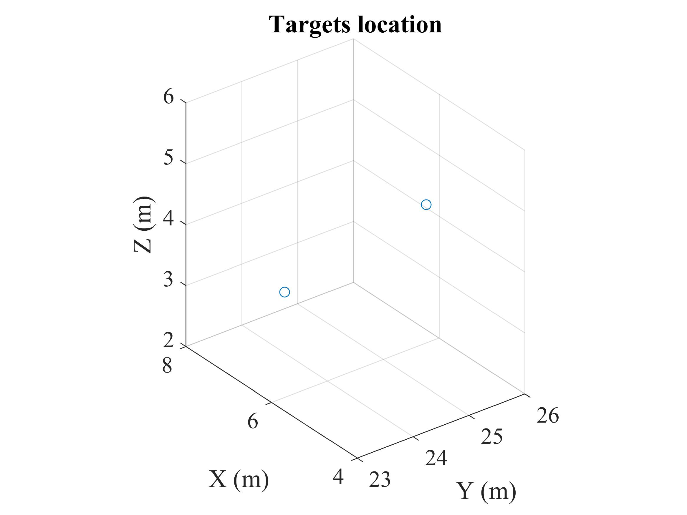
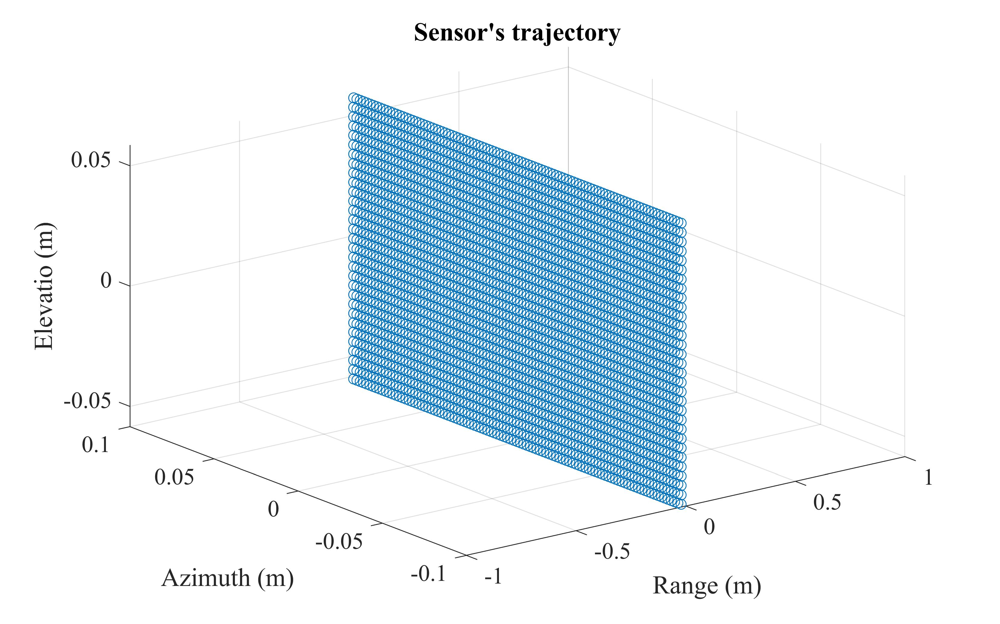
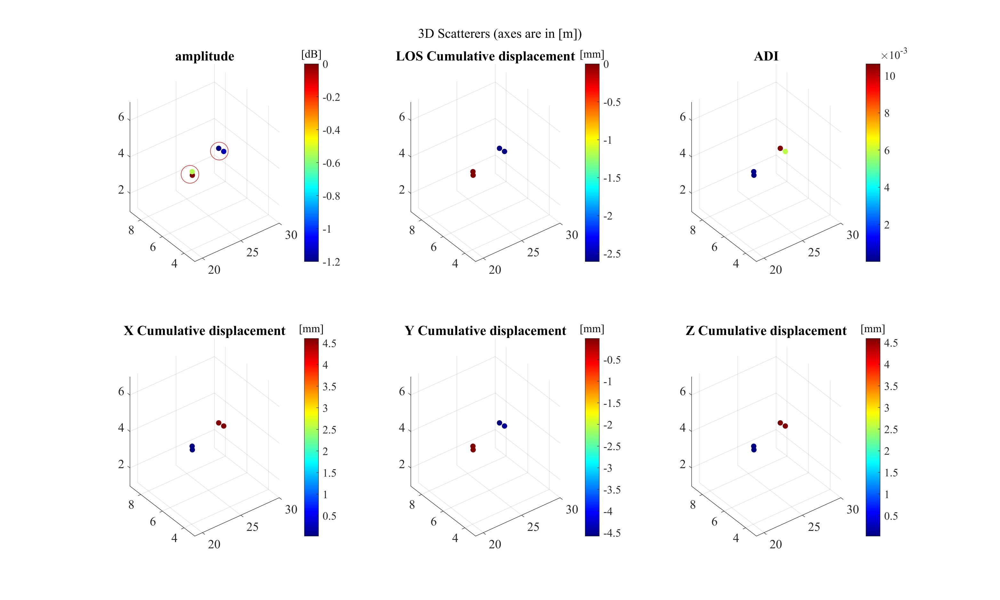
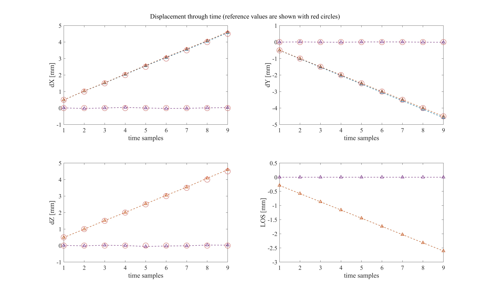

# 3D-GBInSAR
Structural displacement monitoring using ground-based synthetic aperture radar (Implementation of 3D displacement vector)

This repository demonstrates how to retrieve 3D displacement vector by interferometric processing of time-series observations of ground-based SAR (GBSASR) system.
## Usage
First, run "threeD_dsplcmnt_Part1_rawdata.m" to generate the simulated data.
Then, run "threeD_dsplcmnt_Part2_processing_Sim.m" to process the data and estimate the 3D displacement vectors through the time!
Moreover, if you want to see the algorithm's performance on a simulated beautifl bridge, run "threeD_dsplcmnt_BridgeSimulation.m"!

## Results
Here are the results you can obtain by running the codes.

In this example, two point scatterers are simulated: One is fixed and another one is moving!
<p align="center">
 
</p>

Note that in order to resolve the displacement vector in a 3D space first we need to acquire data with both horizontal and vertical baselines!
<p align="center">
 
</p>

In order to easier demonstration of 3D objects I simply convert them into point clouds, while ignoring the unstable scatterers (belonging to background).
<p align="center">
 
</p>

Finally! Here is the estimated displacements in 3D space for the fix and moving scatterers!
<p align="center">
 
</p>


## Paper
Link to the paper: 

[Elsevier](https://www.sciencedirect.com/science/article/pii/S1569843222003326) 

[ResearchGate](https://www.researchgate.net/publication/366313295_Structural_displacement_monitoring_using_ground-based_synthetic_aperture_radar)

## Citation
If you find this work useful, please cite us in your work:
```
@article{3D-GBSAR,
	title = {Structural displacement monitoring using ground-based synthetic aperture radar},
	volume = {116},
	issn = {1872826X},
	doi = {10.1016/j.jag.2022.103144},
	pages = {103144},
	journaltitle = {International Journal of Applied Earth Observation and Geoinformation},
	author = {Hosseiny, Benyamin and Amini, Jalal and Aghababaei, Hossein},
	date = {2023-02},
	note = {Publisher: Elsevier},
	keywords = {{MIMO} radar, Vibration, {mmWave} radar, {SAR} interferometry, Structural health monitoring},
}
```
